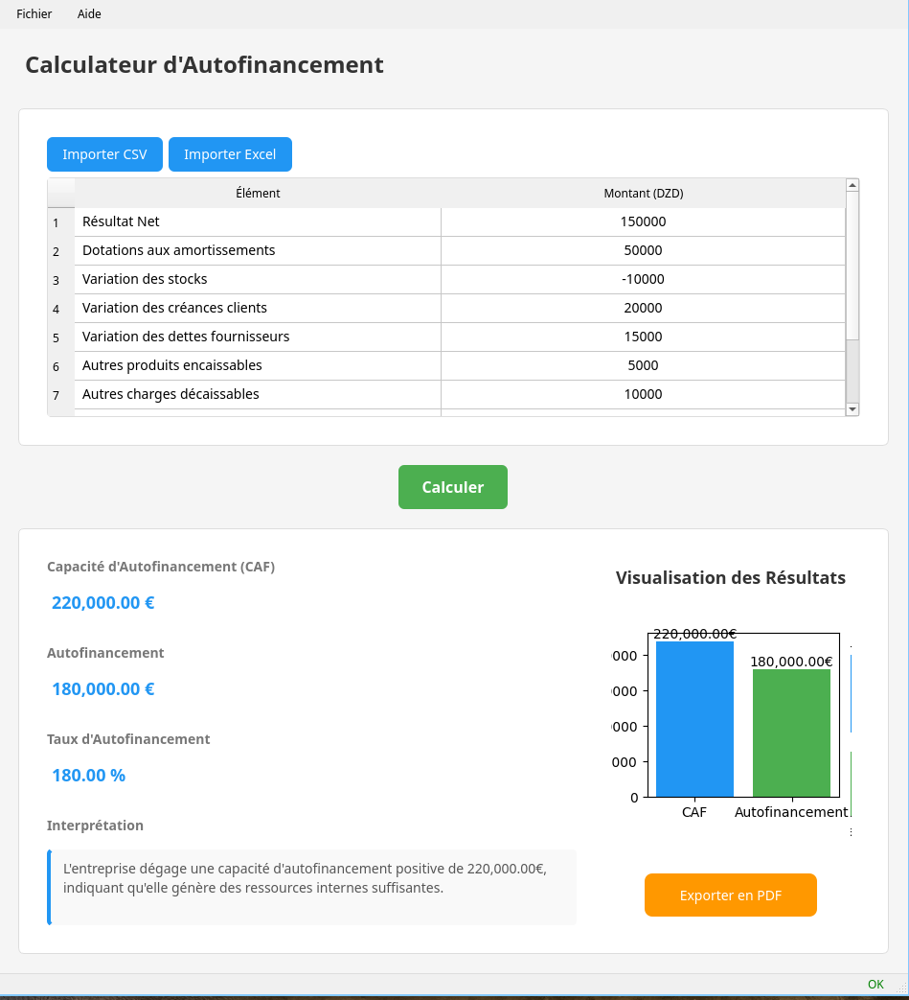
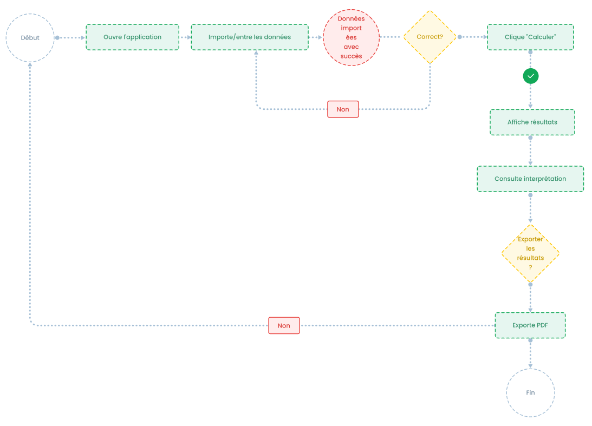

# Calculateur d'Autofinancement

## 📋 Présentation

Outil professionnel pour l'analyse financière des entreprises permettant de calculer et interpréter :

- **CAF** (Capacité d'Autofinancement)
- **Autofinancement**
- **Taux d'autofinancement**

## 🎯 Public Cible

- Responsables financiers
- Chefs d'entreprise
- Étudiants en comptabilité/gestion
- Consultants financiers

## ✨ Fonctionnalités Clés

### 🧮 Calculs Automatiques
- Calcul précis de la CAF selon les normes comptables
- Détermination du taux d'autofinancement
- Analyse de la santé financière

### 📊 Visualisation
- Graphiques professionnels
- Synthèse visuelle des résultats
- Export des graphiques

### 📁 Gestion des Données
- Saisie manuelle intuitive
- Import depuis :
  - Fichiers Excel (.xlsx, .xls)
  - Fichiers CSV
- Historique des derniers fichiers ouverts

### 📄 Reporting
- Génération de rapports PDF
- Mise en page professionnelle
- En-tête et pied de page personnalisables

## 💻 Installation

### Prérequis
- Python 3.8 ou supérieur
- Gestionnaire de packages pip

### Étapes d'installation
1. Télécharger le projet :
   `git clone https://github.com/votreutilisateur/calculateur-autofinancement.git`
   `cd calculateur-autofinancement`

2. Installer les dépendances :
   `pip install -r requirements.txt`

3. Lancer l'application :
   `python main.py`

## 🖥️ Guide d'Utilisation

### 🔄 Workflow Standard

1. **Saisie des données**  
   *(Deux méthodes disponibles)*  
   - ✏️ **Saisie manuelle** :  
     Remplir directement les champs du tableau
   - 📂 **Import fichier** :  
     Menu `Fichier > Importer` (supporte CSV/Excel)

2. **Calcul**  
   - 🖱️ Cliquer sur le bouton `Calculer` (ou `Ctrl+R`)
   - 🔍 Les résultats apparaissent instantanément dans :
     - Le panneau des indicateurs
     - Les graphiques interactifs

3. **Analyse**  
   - 📝 **Interprétation automatique** :  
     Explications détaillées des résultats
   - 📊 **Visualisation** :  
     - Diagramme en barres de la CAF vs Autofinancement  
     - Courbe d'évolution du taux  

4. **Export**  
   - 🖨️ Menu `Fichier > Exporter PDF` (ou `Ctrl+P`)
   - 📄 Options disponibles :
     - Inclure les graphiques
     - Ajouter des commentaires
     - Personnaliser l'en-tête

### 🎮 Raccourcis Clavier
| Action | Raccourci |
|--------|-----------|
| Calculer | Ctrl+R |
| Importer | Ctrl+I |
| Exporter PDF | Ctrl+P |
| Aide | F1 |

### 📷 Capture d'écran
  
*Flux de travail typique de l'application*

### 📚 Documentation Intégrée
L'application inclut :

   Guide d'utilisation détaillé
   Exemples de fichiers valides
   Explications des concepts financiers    